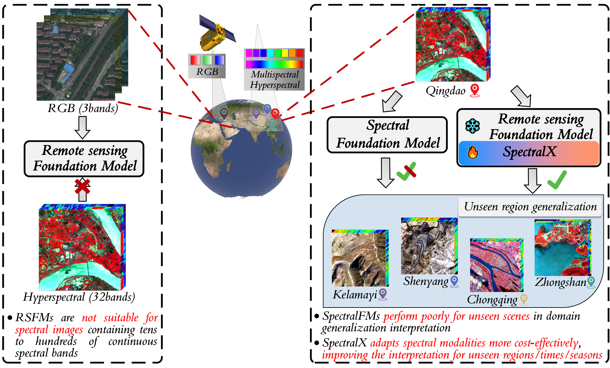
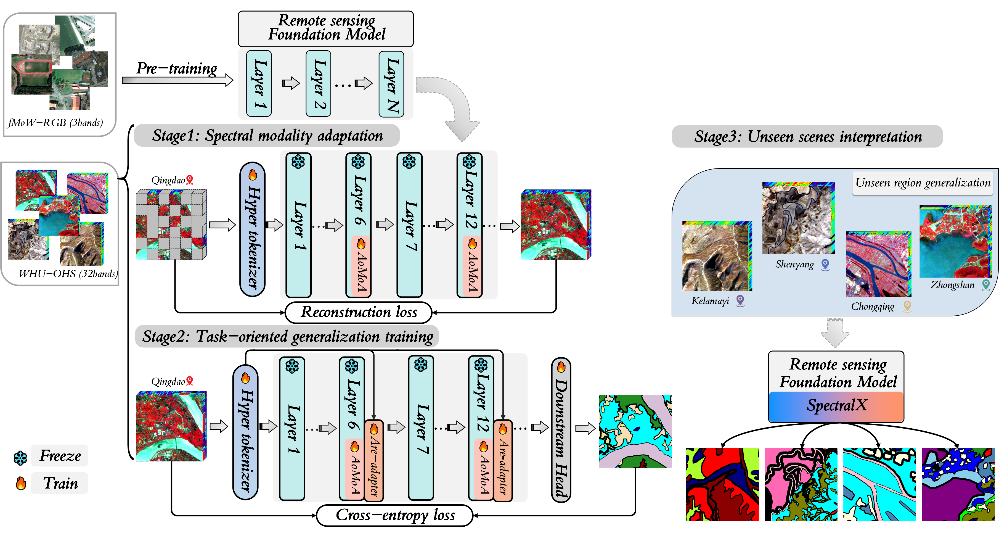
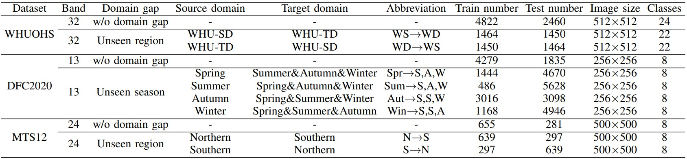

<h1 align="center"><a href="https://arxiv.org/abs/2508.01731" style="color:#9C276A">
SpectralX: Parameter-efficient Domain Generalization for Spectral Remote Sensing Foundation Models</a></h1>
<h4 align="center"> If our project helps you, please give us a star ⭐ on GitHub to support us.</h4>

<div align="center">

[[Paper 📰]](https://arxiv.org/abs/2508.01731) [[Datasets 🤗]](https://huggingface.co/datasets/YuxiangZhang-BIT/SpectralX_datasets)

</div>

## Background


Existing works fail to address the following limitations:
1. Existing Remote Sensing Foundation Models (RSFMs) are primarily designed for RGB optical images, making their architectures unsuitable for spectral images with spatial-spectral information.
2. Both RSFMs and spectral foundation models show weak domain generalization on unseen scenes.
3. Many parameter-efficient fine-tuning methods ignore intrinsic spectral attributes.

## Method


SpectralX is a parameter-efficient fine-tuning method for remote sensing spectral images. Main contributions:
1. SpectralX adapts optical RSFMs to spectral modality with minimal trainable parameters.
2. Hyper Tokenizer (HyperT) explicitly generates spatial-spectral attribute tokens.
3. Attribute-oriented Mixture of Adapter (AoMoA) routes and aggregates experts dynamically.
4. Attribute-refined Adapter (Are-adapter) performs task-oriented progressive refinement.

## Data
We use three spectral semantic segmentation datasets and build eight transfer-learning benchmarks.



### 1) WHUOHS dataset (Hyperspectral)

Download:
- WHU official page (w/o domain gap): https://irsip.whu.edu.cn/resv2/WHU_OHS_show.php
- Unseen-region split (open-sourced): https://huggingface.co/YuxiangZhang-BIT

Observed folder structure:
```text
WHUOHS
|-- tr/
|   |-- image/    (4821 files)
|   `-- label/    (4821 files)
|-- ts/
|   |-- image/    (2459 files)
|   `-- label/    (2459 files)
`-- transfer-STall/
	|-- source/
	|   |-- image/  (1464 files)
	|   `-- label/  (1464 files)
	`-- target/
		|-- image/  (1450 files)
		`-- label/  (1450 files)
```

### 2) DFC2020 dataset (Multispectral)

Download:
- Open-sourced at: https://huggingface.co/YuxiangZhang-BIT

Observed folder structure:
```text
DFC2020
|-- autumn/
|   |-- image/s1_*/ image/s2_*/
|   `-- label/dfc_*/ label/lc_*/
|-- spring/
|   |-- image/s1_*/ image/s2_*/
|   `-- label/dfc_*/ label/lc_*/
|-- summer/
|   |-- image/s1_*/ image/s2_*/
|   `-- label/dfc_*/ label/lc_*/
|-- winter/
|   |-- image/s1_*/ image/s2_*/
|   `-- label/dfc_*/ label/lc_*/
|-- trainset/
|   |-- image/   (4460 files)
|   `-- label/   (4460 files)
`-- testset/
	|-- image/   (1654 files)
	`-- label/   (1654 files)
```

### 3) MTS12 dataset (Multi-temporal multispectral)

Download:
- Open-sourced at: https://huggingface.co/YuxiangZhang-BIT

Observed folder structure:
```text
MTS12
|-- image/
|   |-- train/   (509 files)
|   |-- val/     (130 files)
|   `-- test/    (297 files)
`-- label/
	|-- train/   (509 files)
	|-- val/     (130 files)
	`-- test/    (297 files)
```

## Installation

Install Python dependencies:
```bash
pip install -r requirements.txt
```

For segmentation dependencies:
```bash
pip install openmim
mim install mmsegmentation
```

## Training

### Notes
1. DINOv3 in this repository follows iBOT-style MIM implementation, not MAE. There is no iBOT adaptation in stage1; therefore DINOv3 is used directly in stage2.
2. Check and update all pretrained checkpoint paths in `src/models.py` before running.
3. If dataloader gets stuck during debugging in stage1, set `optim.num_workers=0`.

### Stage1: spectral modality adaptation
Config directory: `configs/stage1`

Key options:
- `data.root`: dataset root path
- `model.adapter_type`: one of `lora`, `ia3`, `low-rank-scaling`, `spectral_adaptation`
- `spectral_adaptation` introduces HyperT + AoMoA

Example:
```bash
python main_mae_stage1.py --config-name experiment_WHUOHS
python main_mae_stage1.py --config-name experiment_DFC
python main_mae_stage1.py --config-name experiment_MTS12
```

### Stage2: task-oriented segmentation adaptation
Config directory: `configs/stage2`

Key options:
- `continual_pretrain_run`: path to a finished stage1 run (wandb offline/online run dir)
- `data.root`: dataset root path
- `model.name`: `upernetSpectralX-DINOv3` or `upernetSpectralX`
- `model.backbone`: `dinov3`, `sat_mae_pp`, or `scale_mae`
- `model.adapter_type`: `lora`, `ia3`, `low-rank-scaling`, `spectral_adaptation`

Example:
```bash
python main_segmentation_stage2.py --config-name experiment_WHUOHS
python main_segmentation_stage2.py --config-name experiment_DFC
python main_segmentation_stage2.py --config-name experiment_MTS12
```

Run DINOv3 directly in stage2:
```bash
python main_segmentation_stage2.py --config-name experiment_WHUOHS_ST model.name=upernetSpectralX-DINOv3 model.backbone=dinov3
```

## Evaluation
```bash
python main_test_checkpoint.py
```

Before running, set `log_path` and `chosen_ckpt` in `main_test_checkpoint.py`.

## Repository overview
Key files/folders:
- `main_mae_stage1.py`: stage1 training entry
- `main_segmentation_stage2.py`: stage2 training entry
- `main_test_checkpoint.py`: evaluation entry
- `configs/stage1/`, `configs/stage2/`: experiment configs
- `src/`: models, datamodules, datasets, trainers
- `data_list/`: train/test split lists

