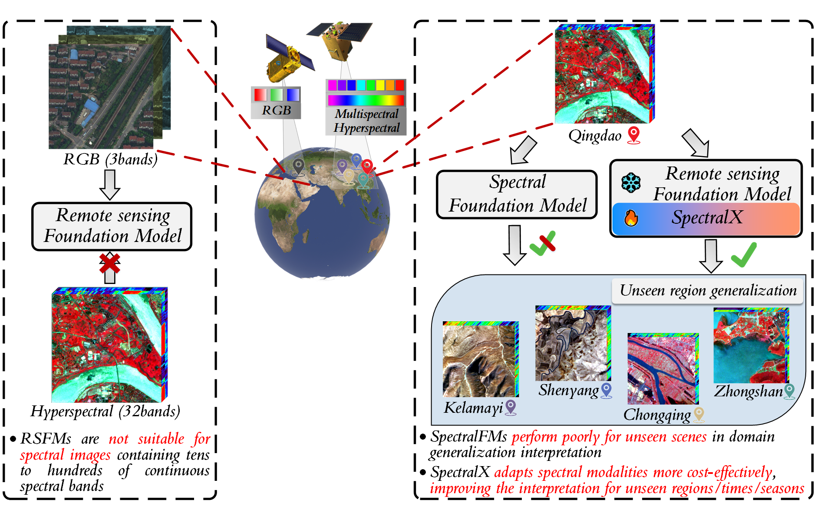

# SpectralX: Parameter-efficient Domain Generalization for Spectral Remote Sensing Foundation Models

# Background

Existing works fail to address the following limitations:
1. Existing Remote Sensing Foundation Models (RSFMs) are primarily designed for RGB optical images, making their architectures unsuitable for spectral images that contain both spatial and spectral multi-dimensional information.
2. Both RSFMs and spectral foundation (SpectralFMs) models exhibit poor domain generalization performance when applied to unseen scenarios, limiting their real-world applicability.
3. Many parameter-efficient fine-tuning methods severely overlook the inherent attributes of spectral images, limiting their adaptability on spectral image.

# Method

In order to address the above issues, we propose SpectralX, a parameter-efficient fine-tuning method tailored for remote sensing spectral images. The main contributions of this paper are as follows:
1. SpectralX, with a minimal number of trainable parameters, adapts RSFMs designed for optical modalities to spectral modalities and utilizes limited labeled data to improve the domain generalization performance of RSFMs.
2. To bridge the domain gap between optical and spectral modalities, we design the Hyper Tokenizer (HyperT) to explicitly generate tokens that capture spatial-spectral attributes.
3. Attribute-oriented Mixture of Adapter (AoMoA) is proposed to employs flexible routing schemes for different attributes and dynamically aggregate effective expert knowledge layer by layer for updating parameters.
4. To achieve task-oriented customized adjustment, the Attribute-refined Adapter (Are-adapter) is proposed. By enabling high-level tokens to continuously query low-level semantic features, it progressively refines the perception of spatial distribution and importance spectrum of land cover classes.

# Data
Currently, datasets used for transfer learning in remote sensing images (domain adaptation & domain generalization) include,
1. RGB optical image (semantic segmentation): ISPRS Vaihingen & Potsdam, LoveDA, etc.
2. Hyperspectral image (image classification): Houston2013 & Houston2018, HyRANK Dioni & Loukia, etc.

*However, there is a lack of datasets for transfer learning in spectral images (semantic segmentation)*. In this paper, we have collected three spectral image datasets: the WHUOHS dataset (hyperspectral), the DFC2020 dataset (multispectral), and the MTS12 dataset (multi-temporal 
multispectral). We have also constructed eight spectral transfer learning evaluation benchmarks, as shown in in the following table. 

Paper: **coming soon**

Code: **coming soon**
